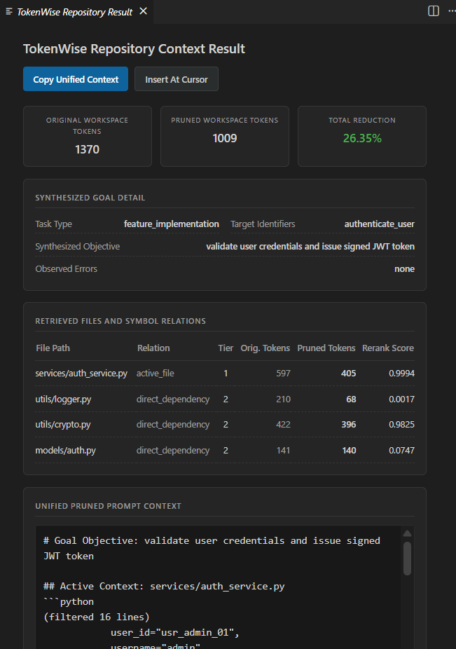
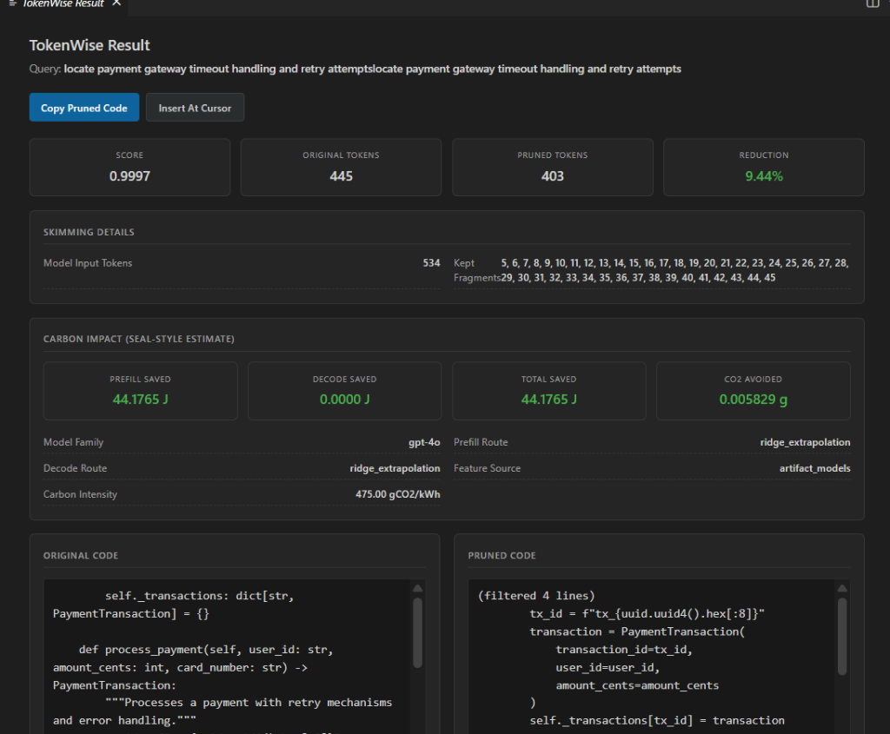

# TokenWise: Sustainable Context Optimization for Coding Agents

[](https://www.python.org/)
[](https://code.visualstudio.com/)
[](https://arxiv.org/abs/2601.16746)
[](https://fastapi.tiangolo.com/)
[](LICENSE)

TokenWise is a Visual Studio Code extension and supporting Python FastAPI backend service designed to solve **context bloat** and **invisible energy consumption** during AI-assisted coding. 

By integrating **task-aware line-level neural skimming** (derived from the Bytedance *SWE-Pruner* paper) with **phase-specific dual-regressor carbon estimation** (derived from the *SEAL* benchmark framework), TokenWise compresses codebases dynamically and reports physical energy (Joules) and CO₂ emissions saved directly in your IDE.

---

## 🏗️ System Architecture & Core Subsystems

```
                                      +------------------------------------+
                                      |      VS Code Extension Client      |
                                      +-----------------+------------------+
                                                        |
                                       Request Prune /  |  Unified Prompt &
                                       Build Context    |  Carbon Metrics
                                                        v
+-------------------------+  Goal JSON   +--------------+------------------+
| Local LLM (Ollama)      |<------------+| FastAPI Backend Service (:8000) |
| (Qwen2.5-Coder Engine)  |------------->+--------------+------------------+
+-------------------------+                             |
                                                        |  AST Scan & Imports Graph
                                                        v
+-------------------------+  Token Logits +-------------+------------------+
| Neural Skimmer Model    |<------------+| Workspace Python codebase        |
| (Qwen3-Reranker-0.6B)   |------------->+--------------+------------------+
+-------------------------+                             |
                                                        |  Prefill / Decode Predictors
                                                        v
+-------------------------+  Phase J / g +--------------+------------------+
| Dual-Mode Carbon Engine |<------------+| XGBoost / Ridge Regressors      |
| (SEAL-trained models)   |------------->+---------------------------------+
+-------------------------+
```

### 1. Goal-Driven Hint Generation
Translates raw developer queries combined with active editor evidence—such as selected lines, active word-at-cursor symbols, active document URI, and real-time VS Code diagnostics (compiler warnings/errors)—into a structured `StructuredGoal` JSON schema via a local Qwen2.5-Coder model (with offline template fallbacks).

### 2. Line-Level Neural Skimming
Feeds the goal objective and chunked, overlapping source code lines into a fine-tuned `SwePrunerForCodePruning` transformer model (0.6B parameters). Token scores are averaged at character offsets and mapped to individual line-level relevance scores.

### 3. Adaptive Context Pruning (3-Tier Budgeting)
Constructs a directed call/import dependency graph of the workspace using Python's `ast` module. Performs BFS traversal to assign file relevance tiers relative to the active file:
* **Tier 1 (Active file):** Lightly pruned (threshold lowered by 0.15) to keep critical edits.
* **Tier 2 (Direct dependencies):** Aggressively pruned (threshold raised by 0.15) to conserve budget.
* **Tier 3 (Transitive references):** Stripped of function bodies and replaced with AST class/function signature stubs.

### 4. Phase-Specific SEAL Carbon Estimation
Implements the SEAL framework to estimate LLM inference carbon footprint non-intrusively. It predicts prefill and decode energy separately by routing requests through a **Dual-Mode Regressor Engine**:
* **XGBoost Regressors:** Used for models $\le 111.0$ Billion parameters (interpolation regime).
* **Ridge Regressors:** Used for models $> 111.0$ Billion parameters (extrapolation regime).
* Fits feature matrices consisting of model size, deployment latency, GPU specifications, and benchmark metrics (MMLU-Pro, BBH).

---

## 🖥️ User Interface Showcase

TokenWise provides a beautiful, native dark-mode Webview UI inside VS Code to display results:

### 1. Repository Context Builder
When running `TokenWise: Build Repository Context`, the extension displays the synthesized search goal card, file tiers with relevance scores, and the compiled context ready for copy/insertion.



### 2. Single-File / Selection Neural Skimmer
When pruning a specific module, the side-by-side view shows the original vs. pruned code diff alongside Kept Fragments, and the physical prefill/decode Joules and CO₂ saved.



---

## ⚙️ Prerequisites (Fresh PC Setup)

- **Python 3.12.x** (Verify with `python --version`)
- **Node.js** & **npm** (Verify with `node -v` and `npm -v`)
- **Git** & **Hugging Face CLI** (`pip install huggingface_hub[cli]` - Verify with `huggingface-cli --help`)
- **VS Code**

> **Note for Windows Users:** If you run into script execution restrictions while activating the virtual environment in PowerShell, run:
> ```powershell
> Set-ExecutionPolicy -Scope Process -ExecutionPolicy Bypass
> ```

---

## 🚀 Installation & Quick Start

### 1. Set Up the Python Backend & Model

1. Open your terminal and navigate to the project directory:
   ```bash
   cd "/e/A A SPL3/part-2/swe-pruner"
   ```

2. Create and activate a virtual environment:
   ```bash
   python -m venv .venv
   source .venv/Scripts/activate  # On PowerShell: .venv\Scripts\Activate.ps1
   ```

3. Install requirements and model-serving code in editable mode:
   ```bash
   cd swe-pruner/swe-pruner
   pip install --upgrade pip
   pip install torch --index-url https://download.pytorch.org/whl/cu126  # Windows CUDA 12.6 support
   pip install -e .
   ```

4. Download the pruner model weights from Hugging Face:
   ```bash
   huggingface-cli download ayanami-kitasan/code-pruner --local-dir ./model
   ```
   *Verify downloaded files:* `ls -lh ./model` should show `model.safetensors` (~1.3 GB).

### 2. Start the FastAPI Service

Run the server on port 8000:
```bash
python -m swe_pruner.online_serving --model-path ./model --port 8000
```
Verify the server health endpoint from another terminal:
```bash
curl -sS http://127.0.0.1:8000/health
```
**Response:** `{"status":"healthy","model_loaded":true}`

### 3. Compile the VS Code Extension

```bash
cd "/e/A A SPL3/part-2/swe-pruner/vscode-extension"
npm install
npm run compile
```

---

## 🎮 Running and Testing in VS Code

1. Open `/e/A A SPL3/part-2/swe-pruner/vscode-extension` in VS Code.
2. Press **F5** to launch the **Extension Development Host**.
3. In the new window, select **File -> Open Folder...** and load the demo project: `/e/A A SPL3/part-2/swe-pruner/Test_project`.
4. Click the status bar icon `$(filter) TokenWise` at the bottom left to confirm connectivity.
5. Open any Python file, select code, or use the Command Palette (`Ctrl+Shift+P` / `Cmd+Shift+P`) to trigger:
   * `TokenWise: Check Backend Health`
   * `TokenWise: Prune Current File` (e.g., query: "optimize retry attempts")
   * `TokenWise: Build Repository Context` (e.g., query: "fix database auth token timeouts")

---

## 🧪 Comprehensive Manual Tests

To verify full system correctness, refer to these step-by-step test plans:

- **Command Line Sanity Checks:** [Manual-test.txt](Manual-test.txt) (contains raw `curl` payloads, health verify scripts, and shutdown commands).
- **Workspace-Level Test Suite:** [extension-test3.md](extension-test3.md) (uses `Test_project` for validation of graph hop-distances, stub generation, and diagnostics ingestion).

---

## 📄 References & Citations

If you are evaluating this project for research or software project labs, please refer to the following foundation works:

```bibtex
@article{wang2026swepruner,
  title={SWE-Pruner: Self-Adaptive Context Pruning for Coding Agents},
  author={Wang, Yuhang and others},
  journal={arXiv preprint arXiv:2601.16746},
  year={2026}
}

@article{pathania2026sealing,
  title={SEALing the Gap: A Reference Framework for LLM Inference Carbon Estimation},
  author={Pathania, Parth and others},
  journal={arXiv preprint arXiv:2603.02949},
  year={2026}
}
```
