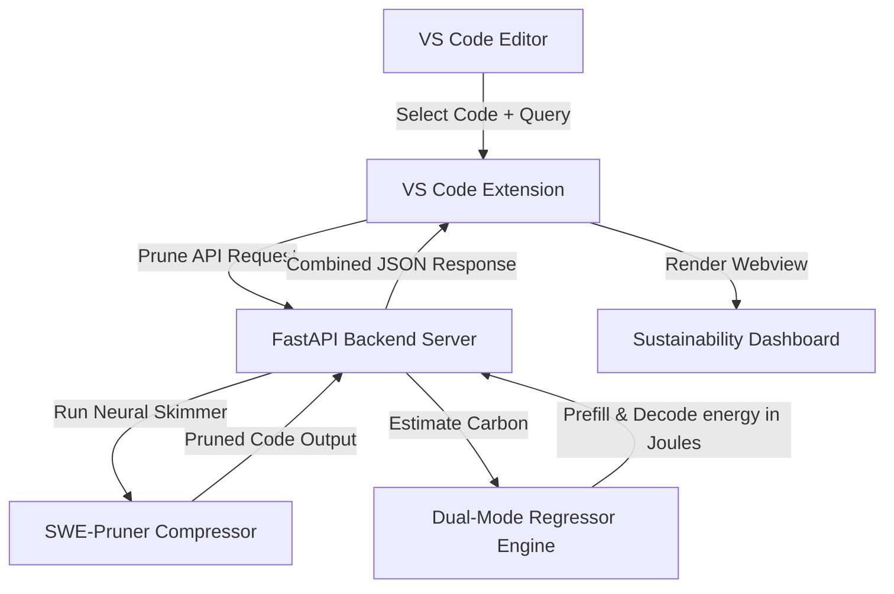

# TokenWise Project Progress Report

**Project Title**: TokenWise: Sustainable Context Optimization for Coding Agents  
**Student**: Adnan Bin Wahid (BSSE-1442)  
**Supervisor**: Mridha Md. Nafis Fuad  
**Institution**: Institute of Information Technology (IIT), University of Dhaka  

---

## 1. Project Overview & Architecture
TokenWise bridges the gap between resource-heavy Large Language Model (LLMs) coding agents and sustainable development. It is an integrated VS Code extension and FastAPI middleware that:
1. Prunes irrelevant code lines dynamically using a local neural skimmer (**SWE-Pruner** framework).
2. Estimates prefill and decode stage energy/carbon savings (**SEAL** framework) using machine learning regressors.
3. Renders visual feedback (token reductions, carbon ROI) in an editor dashboard.

---

## 2. Completed Milestones (What Has Been Done)

### 🟢 Phase A: Data Ingestion & Alignment
* **Multi-Benchmark Feature Fusion**: Formulated the dataset merging pipeline in `merge_benchmarks.py` to perform an inner join between the Open LLM Leaderboard (model capabilities) and LLM-Perf Leaderboard (model inference hardware latencies/energy).
* **Canonicalization Rules**: Defined organization-stripping model name and clean GPU string matching rules to successfully match $101$ custom hardware-model configurations.
* **Unit Calibration & Correction**:
  * Corrected raw optimum-benchmark energy inputs from **Kilowatt-hours (kWh)** to **Joules** ($kWh \times 3,600,000$).
  * Corrected raw latency inputs from total seconds to **milliseconds per token** ($s \times 1000.0 / N_{\text{tokens}}$).
  * Calibrated the energy synthesis formula to accurately output raw Joules using GPU thermal design power (TDP) and latency.

### 🟢 Phase B: Machine Learning Models & Calibration
* **Dual-Mode Routing Engine**: Implemented `DualModeRegressorEngine` which routes models size $\le 111$B to XGBoost (interpolation) and $> 111$B to Ridge Linear Regressors (extrapolation).
* **Hyperparameter Tuning**: Tuned the XGBoost models to `max_depth = 3` and `n_estimators = 100` to prevent overfitting on the merged dataset.
* **Generalization Gains**: Re-trained the model, resulting in:
  * Prefill CV MAPE dropping from **$135.49\%$** to **$13.83\%$** (CV $R^2 = 0.878$).
  * Decode CV MAPE dropping from **$59.53\%$** to **$22.41\%$** (CV $R^2 = 0.246$).
* **External Validation**: Validated the calibrated models against Wilkins et al. empirical benchmarks (LLaMA-2-7B/13B). Achieved an average relative error of **$15.68\%$**, successfully passing the paper's target constraint of **$\le 17.76\%$**.

### 🟢 Phase C: Backend FastAPI Integration
* **FastAPI Server Endpoint**: Integrated the `/estimate-carbon` POST endpoint in `online_serving.py` and connected it to `CarbonEstimator`.
* **Dynamic Token Scaling**: Implemented scaling logic to handle varying prompt lengths:
  $$\text{Prefill Energy (Scaled)} = \text{Prefill Energy (Predicted)} \times \left(\frac{N_{\text{input\_tokens}}}{256.0}\right)$$
  $$\text{Decode Energy (Scaled)} = \text{Decode Energy (Predicted)} \times \left(\frac{N_{\text{output\_tokens}}}{128.0}\right)$$
* **Fallback Safety**: Integrated a robust fallback mechanism using default constants so that estimation remains active if the backend machine learning model weights are missing or loading.

### 🟢 Phase D: VS Code Extension UI & Integration
* **Context Menu Actions**: Added commands for "Prune Selected Code" and "Prune Current File".
* **Sustainability Dashboard**: Implemented a Webview result panel presenting:
  * Pruning score, original vs. pruned token counts, and percentage reduction.
  * Prefill energy saved, Decode energy saved, Total Joules saved, and CO2 emissions avoided in grams.
  * Details of the active estimation (Model, GPU, Routes, Carbon Intensity, and Feature Source).
* **Configuration Management**: Created rich user settings (`package.json`) allowing customization of default thresholds, timeout durations, target GPU profiles, carbon intensity constants, and estimator routing modes (local constants vs. remote machine learning endpoint).

---

## 3. Left to Implement (What is Remaining to Perfectly Finish)

To make TokenWise a production-grade tool and maximize research rigor for SPL3, the following tasks remain:

### 🔴 1. Goal-Driven Hint Generation Extension
* **Goal**: Enhance prompt understanding.
* **Action**: Currently, the raw user search query is sent directly as the query vector. We need to implement a prompt-expansion helper (using a lightweight local LLM or template engine) to automatically transform simple prompts into formal "Goal Hints" (e.g. specifying the edit intent, dependencies, and files affected) before scoring lines.

### 🔴 2. Local JS/TS Inference Engine (ONNX Runtime)
* **Goal**: Enable fully standalone extension execution.
* **Action**: When `tokenWise.carbonEstimatorMode` is set to `local`, the extension currently falls back to linear scale constants. To bring ML precision locally without python backend dependency, we should export the trained XGBoost and Ridge regressors to **ONNX format** and run them in TypeScript using `@microsoft/onnxruntime-web`.

### 🔴 3. Multi-File Context Graph Integration
* **Goal**: Handle complex multi-file context relationships.
* **Action**: Right now, pruning operates on a single file or a single selection. We need to extend the VS Code extension to parse import graphs, select relevant files, bundle them together, and run batch-pruning to generate a unified compressed workspace prompt.

### 🔴 4. Dynamic Real-Time Grid Intensity Integration
* **Goal**: Enable accurate region-aware carbon tracking.
* **Action**: Rather than relying on a hardcoded constant (e.g., $475.0$ gCO2/kWh), we should add a background lookup to call real-time carbon APIs (like electricitymaps.com or CO2Signal) based on the user's localized geography to fetch live grid carbon intensity.

### 🔴 5. Automated Tests Suite
* **Goal**: Secure system stability.
* **Action**: 
  * Backend: Implement unit tests using `pytest` for the `DualModeRegressorEngine` and FastAPI endpoints.
  * Frontend: Create extension integration tests using `@vscode/test-electron` to verify text manipulation commands and webview message passing.
