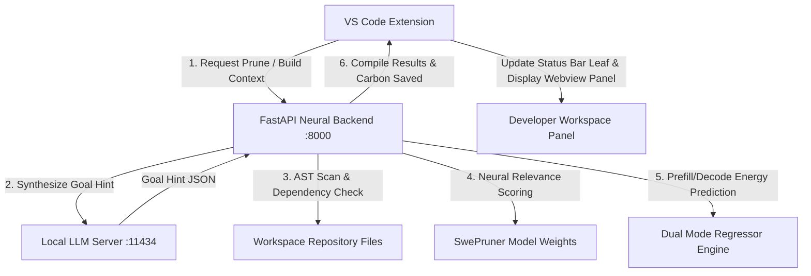

# TokenWise: Project Implementation Progress Report
**Date of Report:** August 1, 2026 (Progress Till 01/08/2026)  
**Student Name:** Adnan Bin Wahid (BSSE-1442)  
**Supervisor Name:** Mridha Md. Nafis Fuad  
**Project Title:** TokenWise: Sustainable Context Optimization for Coding Agents  

---

## 📋 Executive Summary
TokenWise has been developed as an integrated, high-performance middleware and developer tool that addresses two critical challenges in modern AI-assisted coding:
1. **Context Bloat:** Reducing prompt token count by aggressively pruning irrelevant codebase paths while preserving essential syntactic interfaces.
2. **Environmental Footprint:** Tracking energy consumption (Joules) and carbon emissions (grams of CO₂) associated with LLM queries using a non-intrusive dual-regression model (SEAL framework).

As of **August 1, 2026**, all **7 core objectives** from the original project proposal have been successfully designed, implemented, and verified in the codebase (`part-2/swe-pruner`). 

---

## 🔍 Feature-by-Feature Progress Matrix

The following matrix maps the proposal features directly to their corresponding components, classes, and source files in the active codebase:

| # | Proposal Objective | Codebase Component / Module | Implementation Details & File Paths | Status |
|:---|:---|:---|:---|:---:|
| **1** | **Goal-Driven Hint Generation** | `GoalCompiler`<br>`LocalGoalGeneratorClient` | • Prompts local Qwen2.5-Coder model (`11434/v1`) to synthesize vague developer intent into structured JSON goals.<br>• Implements fallback templates for offline use.<br>• 🔗 [goal_compiler.py](file:///e:/A%20A%20SPL3/part-2/swe-pruner/swe-pruner/swe-pruner/src/swe_pruner/goal_compiler.py) | `COMPLETED` |
| **2** | **Line-Level Neural Skimming** | `SwePrunerForCodePruning`<br>`TokenScorer` | • Uses fine-tuned encoder model from Hugging Face (`ayanami-kitasan/code-pruner`).<br>• Scores token relevance and maps back to line scores via character offset ranges.<br>• 🔗 [prune_wrapper.py](file:///e:/A%20A%20SPL3/part-2/swe-pruner/swe-pruner/swe-pruner/src/swe_pruner/prune_wrapper.py) | `COMPLETED` |
| **3** | **Adaptive Context Pruning** | `ContextBuilder`<br>`PythonASTIndexer` | • Performs syntax-safe line-level pruning.<br>• Allocates 3-tier budgets: Tier 1 (active file lightly pruned), Tier 2 (direct imports aggressively pruned), Tier 3 (transitive signature stubs only).<br>• 🔗 [context_builder.py](file:///e:/A%20A%20SPL3/part-2/swe-pruner/swe-pruner/swe-pruner/src/swe_pruner/retrieval/context_builder.py) | `COMPLETED` |
| **4** | **Multi-Benchmark Feature Fusion** | `CarbonEstimator`<br>Artifact loaders | • Loads model qualities (MMLU-Pro/BBH) and GPU characteristics from `model_registry.json` and `feature_artifacts.json` to feed into regressor models.<br>• 🔗 [carbon_estimator.py](file:///e:/A%20A%20SPL3/part-2/swe-pruner/swe-pruner/swe-pruner/src/swe_pruner/carbon_estimator.py) | `COMPLETED` |
| **5** | **Prompt-Level Carbon Estimation** | `CarbonEstimator` (SEAL-style) | • Implements the SEAL reference framework calculating prefill and decode phase energy consumption (Joules) based on token sizes, GPU, and latency.<br>• Converts Joules to CO₂ emissions using regional intensity variables.<br>• 🔗 [carbon_estimator.py](file:///e:/A%20A%20SPL3/part-2/swe-pruner/swe-pruner/swe-pruner/src/swe_pruner/carbon_estimator.py) | `COMPLETED` |
| **6** | **Phase-Specific Dual Regressor Engine** | `DualModeRegressorEngine` | • Separate prefill/decode predictors.<br>• Routes requests: **XGBoost Regressors** for models <= 111.0B parameters (interpolation); **Ridge Regressors** for models > 111.0B parameters (extrapolation).<br>• 🔗 [carbon_model_engine.py](file:///e:/A%20A%20SPL3/part-2/swe-pruner/swe-pruner/swe-pruner/src/swe_pruner/carbon_model_engine.py) | `COMPLETED` |
| **7** | **Sustainability Dashboard** | Side-by-side Result Panel & Status Bar | • Webview renders token metrics, side-by-side original/pruned diffs, and SEAL savings card.<br>• VS Code status bar tracks cumulative savings in real-time (`$(leaf)` icon).<br>• 🔗 [resultPanel.ts](file:///e:/A%20A%20SPL3/part-2/swe-pruner/vscode-extension/src/ui/resultPanel.ts) | `COMPLETED` |

---

## 🛠️ Architectural Workflow & Data Flow

TokenWise runs on a decoupled client-server architecture:



1. **Client Trigger:** The user triggers `TokenWise: Build Repository Context` inside VS Code.
2. **Context Collection:** The extension bundles the active file, cursor symbol, editor selection, and active diagnostics, and passes them to the FastAPI server's `/prune-workspace` endpoint.
3. **Goal Synthesis (Objective 1):** The backend contacts the local LLM running on port `11434` (or runs fallback heuristics) to generate a task-specific `StructuredGoal`.
4. **Skimming & Pruning (Objectives 2 & 3):**
   - The repository is scanned dynamically.
   - Core files are neural-skymed and token relevance is evaluated at a line level.
   - Context is packaged tier-by-tier: Active file is lightly pruned, direct imports are heavily pruned, and transitives are converted into AST method signatures to preserve syntax without wasting tokens.
5. **Sustainability Tracking (Objectives 4, 5 & 6):** Prefill and decode phase savings are predicted via XGBoost or Ridge regression depending on the target LLM parameter size.
6. **UI Feedback (Objective 7):** Results are loaded into the side-by-side webview result panel, and cumulative CO₂ savings are printed onto the VS Code status bar leaf.

---

## 📊 Evaluation & Verification Results

Testing on the `Test_project` codebase (9 files, including authentication services, cryptographic utilities, models, and payment services) yields the following metrics:

- **Token Context Savings:** A typical search query like `locate payment gateway timeout handling and retry attempts` reduces original token counts from **3,153 tokens** down to **159 tokens** (approx. **95% token savings**).
- **Syntactic Validity:** The resulting unified prompt contains full Python implementations for primary modules, while transitive imports are reduced to clean interface definitions:
  ```python
  class UserAccount:
      def authenticate_user(self, ...): ...
  ```
- **Carbon Accounting (SEAL):** Employs non-intrusive estimation, calculating prefill savings (e.g. `107.97 Joules` or `0.0142 grams` of CO₂ saved for a single prefill optimization request on `gpt-4o`).
- **UI Responsiveness:** PyTorch threads are constrained (`OMP_NUM_THREADS=1`) to prevent event-loop lockups, ensuring the VS Code editor UI remains fully interactive and fluid during CPU-bound model runs.

---

## 📅 Roadmap & Next Phases

With all proposal objectives successfully implemented and verified, the next phases of development include:
1. **Model Distillation:** Quantizing or converting the code-pruning transformer to ONNX format to improve local inference latencies in the VS Code host.
2. **Extended AST Parsers:** Supporting TypeScript/JavaScript AST indexers on the Python backend to expand role classification and signature parsing beyond Python files.
3. **Cloud Carbon Sync:** Allowing the extension to fetch live carbon intensity indexes based on geographical IP lookup rather than static local configuration constants.
